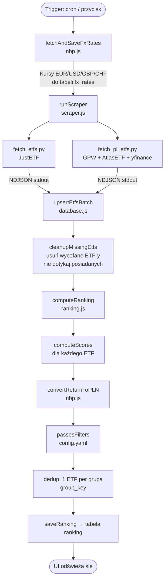
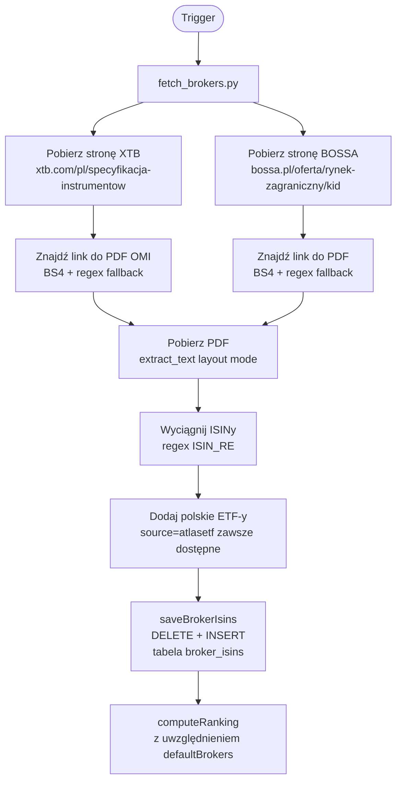
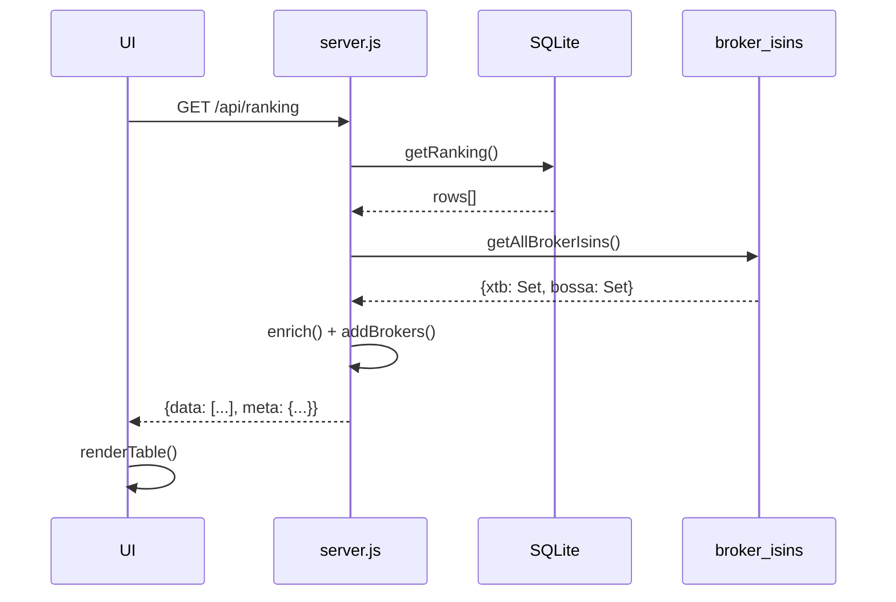

# Momentum ETF · PLN

Aplikacja webowa do rankingowania ETF-ów według strategii momentum, z przeliczeniem stóp zwrotu na PLN. Uruchamia się jako kontener Docker, dane przechowuje w SQLite.

---

## Spis treści

1. [Szybki start](#szybki-start)
2. [Architektura](#architektura)
3. [Workflow aplikacji](#workflow-aplikacji)
4. [Struktura plików](#struktura-plików)
5. [Konfiguracja](#konfiguracja)
6. [Formuła Momentum Score](#formuła-momentum-score)
7. [Grupowanie ETF-ów](#grupowanie-etf-ów)
8. [Źródła danych](#źródła-danych)
9. [Filtr brokerów](#filtr-brokerów)
10. [Przepisy na rozszerzenia](#przepisy-na-rozszerzenia)

---

## Szybki start

```bash
git clone <repo>
cd momentum
docker compose up -d --build
```

Aplikacja dostępna pod `http://localhost` (port 80 → 3000 w kontenerze).

Przy pierwszym uruchomieniu baza jest pusta — aplikacja automatycznie uruchamia pełną aktualizację danych (zajmuje ~5–15 minut).

---

## Architektura

```
┌─────────────────────────────────────────────────────┐
│  Docker container: justetf-momentum                 │
│                                                     │
│  ┌──────────────┐   ┌──────────────┐               │
│  │  Node.js /   │   │  Python 3    │               │
│  │  Express API │   │  scrapers    │               │
│  │  server.js   │   │  fetch_*.py  │               │
│  └──────┬───────┘   └──────┬───────┘               │
│         │                  │                        │
│  ┌──────▼──────────────────▼───────┐               │
│  │       SQLite (momentum.db)      │               │
│  │  etfs │ ranking │ broker_isins  │               │
│  └─────────────────────────────────┘               │
│                                                     │
│  ┌──────────────────────────────────┐              │
│  │  Cron: 07:00 UTC daily           │              │
│  │  Cron: 06:00 UTC 1. dnia mies.   │              │
│  └──────────────────────────────────┘              │
└─────────────────────────────────────────────────────┘
```

**Stack:**
- **Backend:** Node.js 20, Express, better-sqlite3, js-yaml, node-cron
- **Scrapers:** Python 3, pandas, playwright/chromium, yfinance, pypdf, beautifulsoup4
- **Baza:** SQLite (WAL mode)
- **Frontend:** Vanilla JS, IBM Plex Mono / DM Sans

---

## Workflow aplikacji

### Pełna aktualizacja (codziennie 07:00 UTC lub przycisk "Aktualizuj")



### Aktualizacja brokerów (1. dnia miesiąca lub przycisk "Brokerzy")



### Żądanie frontendu



---

## Struktura plików

```
.
├── config.yaml          # Główna konfiguracja (wagi, filtry, brokerzy)
├── groups.yaml          # Reguły grupowania ETF-ów
├── docker-compose.yml   # Definicja usługi Docker
├── Dockerfile           # Budowa obrazu (Node + Python + Playwright)
├── package.json         # Zależności Node.js
│
├── public/
│   └── index.html       # Cały frontend (HTML + CSS + JS w jednym pliku)
│
└── src/
    ├── server.js        # Express API — endpointy REST
    ├── scheduler.js     # Cron + orkiestracja aktualizacji
    ├── scraper.js       # Uruchamianie skryptów Python, zapis do bazy
    ├── ranking.js       # Obliczanie MS, filtrowanie, dedupcja grup
    ├── database.js      # Dostęp do SQLite (wszystkie funkcje DB)
    ├── nbp.js           # Kursy walut z API NBP, konwersja na PLN
    │
    ├── fetch_etfs.py       # Scraper JustETF (5000+ ETF-ów)
    ├── fetch_pl_etfs.py    # Scraper polskich ETF-ów (GPW+AtlasETF+yfinance)
    ├── fetch_brokers.py    # Scraper dostępności u brokerów (PDF-y)
    │
    ├── probe_etf.py        # Narzędzie diagnostyczne: dane jednego ETF
    ├── probe_overview.py   # Narzędzie diagnostyczne: kolumny JustETF
    └── probe_strat.py      # Narzędzie diagnostyczne: strategie JustETF
```

### Opis plików

#### `config.yaml`
Jedyny plik który regularnie edytujesz. Zmiany działają od razu — plik jest czytany przy każdym żądaniu API, bez restartu kontenera.

#### `groups.yaml`
Reguły regex do przypisywania ETF-ów do grup dedupcji. Edytowalny bez restartu. Szczegóły w sekcji [Grupowanie ETF-ów](#grupowanie-etf-ów).

#### `src/server.js`
Serwer Express. Definiuje wszystkie endpointy `/api/*`. Modyfikuj gdy:
- dodajesz nowy endpoint API
- zmieniasz format odpowiedzi
- dodajesz nową zakładkę w UI wymagającą danych z backendu

#### `src/scheduler.js`
Zarządza harmonogramem i stanem uruchomień. Modyfikuj gdy:
- zmieniasz częstotliwość aktualizacji (zmień `CRON_SCHEDULE` w `docker-compose.yml`)
- dodajesz nowy rodzaj aktualizacji (analogicznie do `runBrokerUpdate`)

#### `src/scraper.js`
Uruchamia skrypty Python jako podprocesy, parsuje NDJSON ze stdout, zapisuje do bazy. Modyfikuj gdy:
- dodajesz nowy scraper Python
- chcesz zmienić timeout skryptu

#### `src/ranking.js`
Serce logiki rankingowej. Modyfikuj gdy:
- zmieniasz wzór na Momentum Score
- dodajesz nowy filtr
- zmieniasz logikę dedupcji grup

#### `src/database.js`
Wszystkie operacje SQLite. Modyfikuj gdy:
- dodajesz nową tabelę (dodaj do `initSchema()` i migracji w `runMigrations()`)
- dodajesz nową kolumnę do istniejącej tabeli (dodaj `ALTER TABLE` do `runMigrations()`)
- dodajesz nową funkcję dostępu do danych

#### `src/nbp.js`
Pobiera historyczne kursy walut z `api.nbp.pl`. Obsługuje EUR, USD, GBP, CHF. Modyfikuj gdy:
- dodajesz nową walutę (dodaj do `CURRENCIES`)
- zmieniasz horyzont czasowy kursów

#### `src/fetch_etfs.py`
Pobiera dane z JustETF przez bibliotekę `justetf-scraping`. Modyfikuj gdy:
- biblioteka zmieni format danych (sprawdź `probe_overview.py`)
- chcesz dodać nowe pole z JustETF

#### `src/fetch_pl_etfs.py`
Pobiera polskie ETF-y w trzech krokach:
1. GPW XLS (lista ISIN/ticker) — własny parser BIFF8 przez `olefile`
2. AtlasETF (metadane) — Playwright/Chromium
3. yfinance (dane historyczne, suffix `.WA`)

Modyfikuj gdy:
- AtlasETF zmieni układ strony → patrz sekcja [Zmiana układu AtlasETF](#zmiana-układu-atlasetf)
- GPW zmieni format XLS → patrz parser BIFF8 w funkcji `parse_gpw_xls()`
- yfinance przestanie działać → zamień `enrich_from_yf()` na inne źródło

#### `src/fetch_brokers.py`
Pobiera listy ISINów dostępnych u brokerów z ich stron internetowych (PDF). Modyfikuj gdy:
- dodajesz nowego brokera → patrz sekcja [Dodanie nowego brokera](#dodanie-nowego-brokera)
- broker zmieni stronę/URL → zaktualizuj stałe `XTB_DOCS_URL` / `BOSSA_KID_URL` i słowa kluczowe

#### `public/index.html`
Cały frontend w jednym pliku. Modyfikuj gdy:
- dodajesz nową kolumnę w tabeli → zaktualizuj nagłówek `<th>` i `renderCols()`
- zmieniasz wygląd badge'ów
- dodajesz nowy filtr w toolbarze

---

## Konfiguracja

### `config.yaml` — kompletny opis

```yaml
ranking:
  weights:
    r1m:          0.10    # Waga zwrotu 1M
    r3m:          0.20    # Waga zwrotu 3M
    r6m:          0.45    # Waga zwrotu 6M
    r12m:         0.00    # Waga zwrotu 12M (zazwyczaj 0 gdy używasz r12m_skip1m)
    r12m_skip1m:  0.25    # Zwrot 12M z pominięciem ostatniego miesiąca
    mdd12m:       0.00    # Max drawdown (ujemny, naturalnie karze)

filters:
  defaultMinVolatility: ""      # Min vol roczna (%)
  defaultMaxVolatility: ""      # Max vol roczna (%)
  defaultMinAumMillions: ""     # Min AuM (mln EUR)
  defaultMaxAumMillions: ""     # Max AuM (mln EUR)
  defaultMinTer: ""             # Min TER (%)
  defaultMaxTer: "1.25"         # Max TER (%) — domyślnie odcinamy drogie ETF-y
  defaultMinMS: "2.25"          # Min raw MS (%) — odcina słabe momentum
  defaultMaxMS: ""
  defaultMinAdjMS: ""           # Min MS/Vol (MS znormalizowany)
  defaultMaxAdjMS: ""
  defaultMinR12M: ""            # Min zwrot 12M w PLN (%)
  defaultMaxR12M: ""
  defaultMinMDD12M: ""          # Min MDD 12M (%) — np. -25 odcina MDD < -25%
  defaultMaxMDD12M: ""
  defaultStrategies: []         # Wyklucz strategie: [short-leveraged]
  defaultDividends:  []         # Wyklucz politykę: [Dist]
  defaultCountries:  []         # Wyklucz kraje rejestracji
  defaultBrokers:    []         # Pokaż tylko dostępne u brokerów: [xtb, bossa]
  excludeIsins: []              # Twarde wykluczenia ISINów

scraper:
  maxEtfs: 5000    # Limit ETF-ów z JustETF (pełna baza ~5500)
```

### Zmienne środowiskowe (`docker-compose.yml`)

| Zmienna | Domyślna | Opis |
|---------|----------|------|
| `CRON_SCHEDULE` | `0 7 * * *` | Harmonogram codziennej aktualizacji ETF-ów (UTC) |
| `CRON_BROKERS` | `0 6 1 * *` | Harmonogram aktualizacji brokerów (1. dzień miesiąca) |
| `PORT` | `3000` | Port Express wewnątrz kontenera |
| `DATA_DIR` | `/app/data` | Katalog z bazą SQLite |

---

## Formuła Momentum Score

### MS_raw

Ważona średnia zwrotów w PLN:

```
MS_raw = Σ(wᵢ · Rᵢ) / Σwᵢ
```

gdzie aktywne wagi to te z wartością > 0, a zwroty są przeliczone na PLN:

```
R_PLN = (1 + R_EUR) × (kurs_EUR_teraz / kurs_EUR_N_miesięcy_temu) - 1
```

### R(12M-1M)

Zwrot 12-miesięczny z pominięciem ostatniego miesiąca (klasyczna technika momentum eliminująca krótkoterminowy reversal):

```
R(12M-1M) = (1 + R12M) / (1 + R1M) - 1
```

Jest to wyrażenie **nieliniowe** — nie równoważne żadnej kombinacji liniowej R12M i R1M.

### MS_adj

MS znormalizowany przez zmienność — pozwala porównywać ETF-y o różnej volatility:

```
MS_adj = MS_raw / Vol_roczna
```

Ranking domyślnie sortuje po `MS_adj`.

### Gdzie zmienić wzór

Plik: `src/ranking.js`, funkcja `computeScores()`.

Przykład — dodanie nowego okresu (np. 2M):
1. Dodaj `perf_2m` do tabeli `etfs` w `database.js` (schema + migracja)
2. Pobierz dane w scraperze
3. Dodaj `r2m = convertReturnToPLN(etf.perf_2m, fx, '2m')` w `computeScores()`
4. Dodaj `{ key: 'r2m', r: r2m, w: weights.r2m ?? 0 }` do `candidates`
5. Dodaj `r2m: 0.00` do `config.yaml`

---

## Grupowanie ETF-ów

ETF-y z tej samej kategorii (np. różni emitenci tego samego indeksu) są grupowane — w rankingu pokazuje się tylko najlepszy reprezentant grupy. Reszta jest dostępna po kliknięciu `+N`.

### `groups.yaml` — format reguły

```yaml
rules:
  - pattern: 'S&P 500'        # Regex (case-insensitive) na oczyszczoną nazwę ETF
    group: 'equity: s&p500'   # Klucz grupy
    types: Equity             # Opcjonalne: filtruj po asset_class (string lub lista)
    sources: justetf          # Opcjonalne: filtruj po źródle danych (string lub lista)

  - pattern: 'WIG'
    group: 'region: poland'
    types: [Akcje, Equity]
    sources: atlasetf
```

**Jak działa `clean_name()`:** przed dopasowaniem regex usuwa prefix dostawcy (iShares, Amundi, Xtrackers…) i suffix `UCITS ETF`. Regex pisze się więc na oczyszczoną nazwę, np. `'S&P 500'` zamiast `'iShares Core S&P 500 UCITS ETF USD (Acc)'`.

**Fallback:** jeśli żadna reguła nie pasuje, `group_key = asset_class:cleaned_name` (każdy ETF tworzy własną grupę).

### Sprawdzenie dopasowań

```bash
docker exec justetf-momentum python3 /app/src/probe_etf.py "S&P 500"
```

---

## Źródła danych

### JustETF (`fetch_etfs.py`)

Biblioteka `justetf-scraping` pobiera pełny przegląd ETF-ów z justetf.com. Dane obejmują: performance (EUR), vol, TER, AuM, asset class, region, domicile, strategię.

**Diagnostyka:**
```bash
docker exec justetf-momentum python3 /app/src/probe_overview.py   # struktura danych
docker exec justetf-momentum python3 /app/src/probe_etf.py ISIN   # dane jednego ETF
```

### GPW XLS (`fetch_pl_etfs.py`)

Pliki XLS ze strony gpw.pl zawierają ticker, ISIN i walutę polskich ETF/ETC/ETN. Format to stary BIFF8 (OLE2, `.xls`) — parser własny przez `olefile` + `struct`, ponieważ standardowe biblioteki (`xlrd`, `openpyxl`) nie obsługują tego formatu prawidłowo.

URL-e: `https://www.gpw.pl/etfy?download_xls=1/2/3`

### AtlasETF (`fetch_pl_etfs.py`)

Strona renderowana przez React — wymagany Playwright/Chromium. Pobiera: nazwę, TER, AuM (PLN), replikację, dywidendy, strategię, hedging, domicile, asset class, region, kategoria.

Nazwa ETF pobierana z tytułu strony (`<title>`), format: `Nazwa ETF | ISIN`.

### yfinance (`fetch_pl_etfs.py`)

Historyczne ceny polskich ETF-ów z Yahoo Finance, ticker w formacie `ETFBM40TR.WA` (suffix `.WA`). Wymaga odblokowania `fc.yahoo.com` jeśli używasz pfBlockerNG lub pi-hole.

Obliczane: perf_1m/3m/6m/12m, mdd12m, volatility (w PLN).

### NBP API (`nbp.js`)

`api.nbp.pl` — historyczne kursy EUR, USD, GBP, CHF z ostatnich 255 dni sesyjnych.

### PDF brokerów (`fetch_brokers.py`)

PDF parsowany przez `pypdf` z `extraction_mode="layout"` (zapobiega sklejaniu wyrazów).

---

## Filtr brokerów

Gdy `defaultBrokers: [xtb]` w `config.yaml`, ranking pokazuje tylko ETF-y dostępne u XTB. Polskie ETF-y (source=`atlasetf`) są zawsze dostępne u obu brokerów — nie wymagają sprawdzania w PDF.

Dane brokerów są przechowywane w tabeli `broker_isins` i aktualizowane osobno (przycisk "Brokerzy" lub cron 1. dnia miesiąca).

---

## Przepisy na rozszerzenia

### Zmiana układu strony AtlasETF

Funkcja `extract_atlas_page()` w `fetch_pl_etfs.py` używa `get_labeled(label)` — szuka elementu z dokładnym tekstem etykiety, potem bierze następny element rodzeństwo lub ostatnie dziecko rodzica.

Jeśli strona się zmieni:
1. Sprawdź nową strukturę HTML w DevTools
2. Zaktualizuj etykiety w wywołaniach `get_any('Nowa etykieta', 'Stara etykieta')`  
3. Jeśli zmienił się layout (nie sibling, lecz inne relacje), zaktualizuj `get_labeled()`

Testowanie:
```bash
docker exec justetf-momentum python3 -c "
import sys; sys.path.insert(0,'/app/src')
from fetch_pl_etfs import scrape_atlas_batch
import json
print(json.dumps(scrape_atlas_batch(['PLBETF400025']), indent=2, ensure_ascii=False))
"
```

### Dodanie nowego brokera

1. **`src/fetch_brokers.py`** — dodaj stałe URL i słowa kluczowe:
   ```python
   MÓJBROKER_URL = 'https://mójbroker.pl/strona-z-dokumentami'
   MÓJBROKER_KEYWORDS = ['Lista ETF', 'instrumenty dostępne']

   def fetch_mójbroker_isins() -> set[str]:
       html = fetch_url(MÓJBROKER_URL)
       pdf_url = find_pdf_href(html, MÓJBROKER_KEYWORDS, MÓJBROKER_URL)
       pdf_data = fetch_url(pdf_url, binary=True)
       return extract_isins_from_pdf(pdf_data)
   ```

2. **`src/fetch_brokers.py`** — dodaj wywołanie w `main()`:
   ```python
   mójbroker_isins = fetch_mójbroker_isins() | pl_isins
   for isin in sorted(mójbroker_isins):
       print(json.dumps({'broker': 'mójbroker', 'isin': isin}))
   ```

3. **`src/scraper.js`** — dodaj `'mójbroker'` do `expectedBrokers`

4. **`public/index.html`** — dodaj w `BROKER_LABELS` i CSS:
   ```js
   const BROKER_LABELS = { xtb: 'XTB', bossa: 'BOSSA', mójbroker: 'MÓJ' };
   ```
   ```css
   .broker-mójbroker { background: rgba(0,100,200,.12); color: #0064c8; border: 1px solid rgba(0,100,200,.3) }
   ```

5. **`config.yaml`** — możesz teraz używać `defaultBrokers: [mójbroker]`

### Dodanie nowej kolumny

Przykład: dodanie `n_holdings` (liczba spółek w indeksie) do tabeli rankingu.

1. **`src/database.js`** — dodaj do `initSchema()` w tabeli `ranking` i do `runMigrations()`:
   ```js
   'ALTER TABLE ranking ADD COLUMN n_holdings INTEGER'
   ```
   Dodaj do `RANKING_DEFAULTS`: `n_holdings: null`

2. **`src/ranking.js`** — przekaż pole w `allScored.push({...})`:
   ```js
   n_holdings: etf.n_holdings ?? null,
   ```

3. **`src/server.js`** — dodaj do obiektu zwracanego przez `/api/group/:key`:
   ```js
   n_holdings: etf.n_holdings,
   ```

4. **`public/index.html`** — dodaj `<th>` w nagłówkach wszystkich tabel i `<td>` w `renderCols()`:
   ```js
   <td class="r">${r.n_holdings ?? '<span class="nd">—</span>'}</td>
   ```

### Dodanie nowego filtra

Przykład: filtr `defaultMinNHoldings` (min liczba spółek).

1. **`config.yaml`** — dodaj parametr:
   ```yaml
   defaultMinNHoldings: ""
   ```

2. **`src/ranking.js`** — dodaj w `passesFilters()`:
   ```js
   const minNHoldings = num(f.defaultMinNHoldings);
   if (minNHoldings != null && (etf.n_holdings == null || etf.n_holdings < minNHoldings)) return false;
   ```

### Zmiana harmonogramu

W `docker-compose.yml`:
```yaml
environment:
  - CRON_SCHEDULE=0 7 * * *    # codziennie o 07:00 UTC
  - CRON_BROKERS=0 6 1 * *     # 1. dnia miesiąca o 06:00 UTC
```

Format: `min godz dzień miesiąc dzień_tygodnia`. Generator: https://crontab.guru

### Aktualizacja ręczna

```bash
# Pełna aktualizacja (ETF-y + ranking)
curl -X POST http://localhost/api/refresh

# Tylko brokerzy
curl -X POST http://localhost/api/refresh-brokers

# Tylko przelicz ranking (bez pobierania danych)
docker exec justetf-momentum node -e "
const {computeRanking}=require('./src/ranking');
const yaml=require('js-yaml');
const fs=require('fs');
const config=yaml.load(fs.readFileSync('/app/config.yaml','utf8'));
console.log(computeRanking(config),'ETFów');
"
```

### Diagnostyka bazy danych

```bash
# Sprawdź zawartość bazy
docker exec justetf-momentum sqlite3 /app/data/momentum.db \
  "SELECT source, count(*) FROM etfs GROUP BY source"

# ETF-y z atlasetf z danymi historycznymi
docker exec justetf-momentum sqlite3 /app/data/momentum.db \
  "SELECT isin, name, perf_1m, perf_12m, volatility FROM etfs WHERE source='atlasetf' LIMIT 10"

# Stan brokerów
docker exec justetf-momentum sqlite3 /app/data/momentum.db \
  "SELECT broker, isin_count, last_run_at, status FROM broker_updates"

# Ostatnie joby
docker exec justetf-momentum sqlite3 /app/data/momentum.db \
  "SELECT * FROM job_log ORDER BY id DESC LIMIT 5"
```

---

## API Reference

| Metoda | Endpoint | Opis |
|--------|----------|------|
| GET | `/api/ranking` | Pełny ranking z brokerami |
| GET | `/api/status` | Status aktualizacji, czas ostatniego runu |
| POST | `/api/refresh` | Uruchom pełną aktualizację |
| POST | `/api/refresh-brokers` | Aktualizuj dane brokerów |
| GET | `/api/brokers` | Status i liczba ISINów per broker |
| GET | `/api/group/:key` | Wszystkie ETF-y z grupy (po group_key) |
| GET | `/api/owned` | Lista posiadanych ETF-ów |
| POST | `/api/owned/:isin` | Oznacz ETF jako posiadany |
| DELETE | `/api/owned/:isin` | Usuń z posiadanych |
| GET | `/api/ignored` | Lista ignorowanych ETF-ów |
| POST | `/api/ignore/:isin` | Ignoruj ETF |
| DELETE | `/api/ignore/:isin` | Przywróć z ignorowanych |
| POST | `/api/group/:key/rep` | Ustaw reprezentanta grupy |
| DELETE | `/api/group/:key/rep` | Zresetuj reprezentanta grupy |
| GET | `/api/config` | Aktualna konfiguracja |
| GET | `/api/history` | Historia uruchomień (ostatnie 20) |
